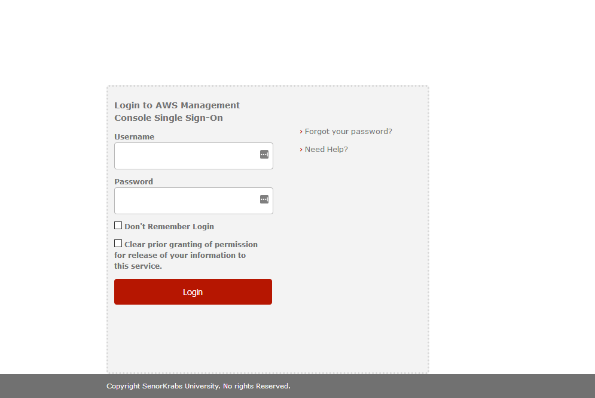
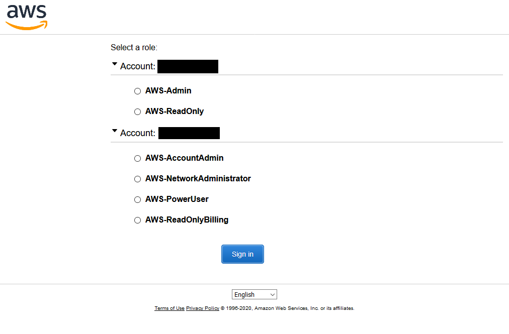
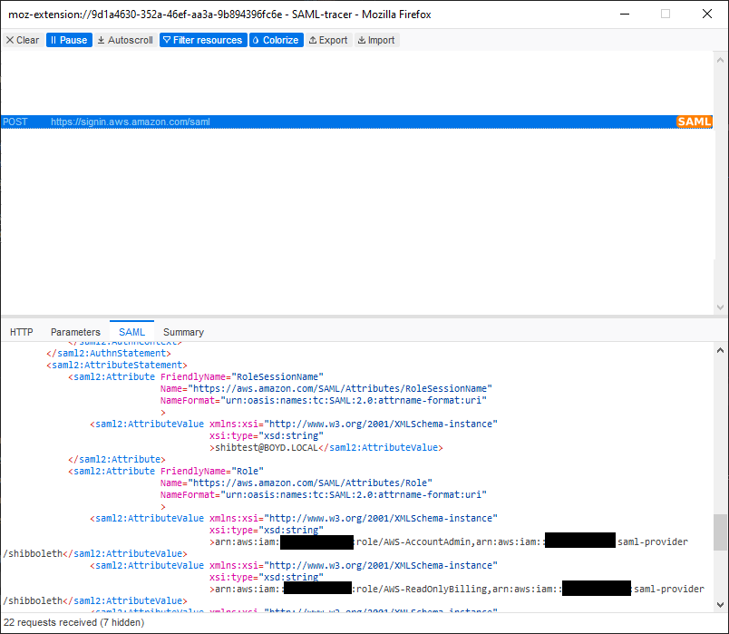

# Shibboleth Configuration Guide for AWS Services

This guide contains instructions and example configs for using Shibboleth 3.x as an Identity Provider for AWS services.

## Prerequisites
- **Shibboleth 3.x Server**: You must have a Shibboleth server setup already. 
- **LDAP-based backend**: This tutorial assumes that you are using an LDAP backend for password authentication and attribute resolution. Other backends can certainly work, but this tutorial is based on an Active Directory backend.
- **IAM SAML Identity Provider**: You must have a [SAML Identity Provider](https://docs.aws.amazon.com/IAM/latest/UserGuide/id_roles_providers_create_saml.html) confifgured in all of your accounts, with a consistent name. You can use [saml-idp-cfn-with-roles.yaml](https://github.com/senorkrabs/cfn-saml-idp/saml-idp-cfn-with-roles.yaml) to deploy this. 
- **IAM Roles for Federation**: The roles that users will assume during federation must be defined in each AWS account and have a [policy attached that allows federation from your SAML Identity Provider](https://docs.aws.amazon.com/IAM/latest/UserGuide/id_roles_providers_enable-console-saml.html). You can use [saml-idp-cfn-with-roles.yaml](https://github.com/senorkrabs/cfn-saml-idp/blob/master/saml-idp-cfn-with-roles.yaml) to deploy these. 
- **LDAP Groups**: You must have LDAP groups (or Security Groups in Active Directory) for each account and role that you want to allow users to assume, and have added the appropriate users to that group. The naming convention for the LDAP Groups should be: `AWS-[account-id]-[role-name]`. Example: `AWS-123456789012-PowerUser`. 
    
    A naively simplistic .bat file for creating Security Groups in AD is available here: [create-ad-security-groups.bat](create-ad-security-groups.bat)
    
    It is assumed you've set this up using the instructions in the [cfn-saml-idp repo](https://github.com/senorkrabs/cfn-saml-idp). 

## Shibboleth Config File Examples
If you're looking for Shibboleth config files, the are provided in two subfolders in the repository:
- [shibconfig-example](https://github.com/senorkrabs/aws-shibboleth-config-guide/tree/master/shibconfig-example): Contains an sample config files with settings for using Shibboleth as an IdP for the AWS Console
- [shibconfig-example-advanced](https://github.com/senorkrabs/aws-shibboleth-config-guide/tree/master/shibconfig-example-advanced): Contains an sample config files with settings for using Shibboleth with AWS SSO, Cognito, and AppStream. 


## Metadata Provider and Relying Party Configuration
First, we'll configure AWS as an SP by defining the Metadata Provider.

### /opt/shibboleth-idp/conf/metadata-providers.xml

First, we need to add the SP as a provider so that Shibboleth trusts it. AWS's SP metadata document is available publicly at https://signin.aws.amazon.com/static/saml-metadata.xml. You'll see in this Metadata that the AWS SP's EntityId is `urn:amazon:webservices`, which will be used throughout this guide to configure the provider.

Inside top-level `<MetadataProvider>` element, add the following provider:
```xml
    <MetadataProvider id="AWS"  
        xsi:type="FileBackedHTTPMetadataProvider" 
        backingFile="%{idp.home}/metadata/aws.xml"
        metadataURL="https://signin.aws.amazon.com/static/saml-metadata.xml"
    />
```
The configuration element above configures Shibboleth to retrieve the AWS Metadata document from the Url and store it locally. 


### /opt/shibboleth-idp/conf/relying-party.xml

Next, we need to configure the profile for the SP so that Shibboleth knows how to format SAML document when sending a SAML assertion to the AWS SP (`urn:amazon:webservices`).

Inside the element `<util:list id="shibboleth.RelyingPartyOverrides">` add the following bean:
```xml
        <bean parent="RelyingPartyByName">
            <constructor-arg name="relyingPartyIds">
                <list>
                    <value>urn:amazon:webservices</value>
                </list>
            </constructor-arg>               
            <property name="profileConfigurations">
                <list>
                    <bean parent="Shibboleth.SSO" />
                    <bean parent="SAML2.SSO"
                        p:encryptAssertions="false"
                        p:assertionLifetime="PT5M"
                        p:signResponses="false"
                        p:signAssertions="true"
                        p:includeConditionsNotBefore="true"
                        p:includeAttributeStatement="true"
                        p:nameIDFormatPrecedence="urn:oasis:names:tc:SAML:2.0:nameid-format:persistent"
                        p:additionalAudiencesForAssertion="urn:amazon:webservices"
                        />
                    <ref bean="SAML2.ECP" />
                    <ref bean="SAML2.Logout" />
                    <ref bean="SAML2.AttributeQuery" />
                    <ref bean="SAML2.ArtifactResolution" />
                </list>
            </property>
        </bean>     
```        

### /opt/shibboleth-idp/conf/saml-nameid.xml
The SAML standard indicates the Subject should contain a NameID that indicates who the authenticated principal is. This value should be unique for each user and never change. For this configuration, it is assumed that the AD attribute `userPrincipalName` will never change, and can be used as the NameID value.

To configure this, open `saml-nameid.xml` and add the following inside the `<util:list id="shibboleth.SAML2NameIDGenerators">` element:
```xml
        <bean parent="shibboleth.SAML2AttributeSourcedGenerator" p:omitQualifiers="true" p:format="urn:oasis:names:tc:SAML:2.0:nameid-format:persistent" p:attributeSourceIds="#{ {'userPrincipalName'} }">
            <property name="activationCondition">
                <bean parent="shibboleth.Conditions.RelyingPartyId">
                    <constructor-arg name="candidates">
                        <list>
                            <value>urn:amazon:webservices</value>
                        </list>
                    </constructor-arg>
                </bean>
            </property>
        </bean>
```
**Note**: Shibboleth is usually configured with a transient NameID by default. This may work when authenticating to the AWS SAML endpoint, but other SPs, including AWS SSO, persistent values. It's a good idea to configure this.

## Configuring Attributes
Shibboleth can resolve and insert Attributes (claims) into the SAML Response that is sent back to the user after authenticating. The AWS SP expects two attributes to be returned:
- **Role **

  Example: `arn:aws:iam::<account-id>:role/RoleName,arn:aws:iam::<account-id>:saml-provider/<provider-name>`
- RoleSessionName

  Example: `username` or `username@domain.com`

Multiple Roles can be included in the SAML Response to indicate that the principal is authorized to assume various roles in various AWS accounts. 

To query these attributes, we must configure an attribute resolver. To return these attributes, we must configure an attribute filter.

### /opt/shibboleth-idp/conf/attribute-resolver.xml
Inside the `<AttributeResolver>` element, add the following definitions:

```xml
<AttributeDefinition id="awsRoles" xsi:type="Mapped" sourceAttributeID="memberOf">
        <InputDataConnector ref="myLDAP" attributeNames="memberOf"/>
        <AttributeEncoder xsi:type="SAML2String" name="https://aws.amazon.com/SAML/Attributes/Role" friendlyName="Role" />
            <ValueMap>
                <ReturnValue>arn:aws:iam::$1:role/AWS-$2,arn:aws:iam::$1:saml-provider/shibboleth</ReturnValue>
            <SourceValue>CN=AWS-(\d{12})-(\w*),.*</SourceValue>
            </ValueMap>
    </AttributeDefinition>
    
    <AttributeDefinition id="awsRoleSessionName" xsi:type="Simple" sourceAttributeID="userPrincipalName">
        <InputDataConnector ref="myLDAP" attributeNames="userPrincipalName"/>
        <AttributeEncoder xsi:type="SAML2String" name="https://aws.amazon.com/SAML/Attributes/RoleSessionName" friendlyName="RoleSessionName" />
    </AttributeDefinition>
```
**Note**: The configuration above assumes your accounts are all configured with an IAM identity provider named `shibboleth` and that the names of roles in your Accounts are prefixed with `AWS-`. 

For example, if your user is a member of the LDAP Group `AWS-123456789012-PowerUsers` then you should have a role in account `123456789012` named `AWS-PowerUsers`. In your SAML response, the result will be transformed into: `arn:aws:iam::123456789012:role/AWS-PowerUsers,arn:aws:iam::<account-id>:saml-provider/shibboleth`

### /opt/shibboleth-idp/conf/attribute-filter.xml
After Shibboleth resolves attributes, it filters the response based on rules, including who the `RelyingParty` is. Add the following inside the `<AttributeFilterPolicyGroup>` element of `attribute-filter.xml` so that Role and RoleSessionName are returned when the `Requester` is `urn:amazon:webservices`:
```xml
    <AttributeFilterPolicy id="releaseAWSToAWS">
        <PolicyRequirementRule xsi:type="Requester" value="urn:amazon:webservices"/>
        <AttributeRule attributeID="awsRoles">
            <PermitValueRule xsi:type="ValueRegex" regex="arn\:aws\:iam\:\:\d{12}\:role\/AWS-.*"/>
        </AttributeRule>
        <AttributeRule attributeID="awsRoleSessionName">
            <PermitValueRule xsi:type="ANY"/>
        </AttributeRule>
	    <AttributeRule attributeID="userPrincipalName">
	        <PermitValueRule xsi:type="ANY" />
	    </AttributeRule>	         
    </AttributeFilterPolicy>
```

When you have updated all of the configuration files, restart Shibboleth to reload the configs. The easiest way to do this is to restart the tomcat service.

If tomcat fails to start or the IdP isn't available, you can review the logs at:
- `/opt/shibboleth-idp/logs`
- `/usr/local/tomcat/logs` (location may vary)

## Testing Authentication

When testing and troubleshooting authentication, it is recommended that you install and use a SAML tracing tool in your browser, such as [SAML-tracer](https://addons.mozilla.org/en-US/firefox/addon/saml-tracer/).

1. Start the SAML tracer and navigate to `https://shibboleth-host/idp/profile/SAML2/Unsolicited/SSO?providerId=urn:amazon:webservices` (where `shibboleth-host` is your host name). You should be presented with a login screen from Shibboleth. Enter your credentials and login.


2. After successfully authenticating, you can select a account and role to connect to, based on the LDAP groups you created and are a member of.


    In the SAML-tracer, you will see the POST request that was made to https://signin.aws.amazon.com/saml that contains the IdP's SAML response:
    

    Selecting the request and navigating to the **SAML** tab, you will see the decoded SAML Response. Within the response, you should see the `AttributeValue` tags with `RoleSessionName` and `Role`. 
    
    If there are no roles listed or an error is returned at the AWS Signin page, and there is an issue with your Shibboleth configuration or you are not a member of any LDAP groups that follow the naming convention `AWS-[account-id]-[role-name]`. You'll need to troubleshoot this.

3. Select one of the roles and click **Sign In**. You should be redirected to the AWS Console and signed in as that role.

## Troubleshooting
Below are common issues and steps to troubleshoot. It may also be helpful to look at the [example Shibboleth configuration files](shibconfig-example/) for comparison.

You can also look at the logs on the Shibboleth server:
- `/opt/shibboleth-idp/logs`
- `/usr/local/tomcat/logs` (location may vary)

### AWS Sign-in Page Error and the SAML Response returns no roles
1. Verify the user you authenticated as is a member of at least one LDAP group with the naming convention `AWS-[account-id]-[role-name]`. 
2. Verify that `attribute-resolver.xml` and `attribute-filter.xml` have been configured correctly.
3. On the Shibboleth server, `curl https://127.0.0.1/idp/profile/admin/resolvertest?principal=[username]&requester=urn:amazon:webservices` (replacing [username] with your username you authenticated with) and verify if `RoleSessionName` and `Role` is being set. 

If they are being set, there is likely an issue with your `relying-party.xml` config. If they are not being set, the issue is likely due to `attribute-resolver.xml` or `attribute-filter.xml` misconfigurations. Also check the logs for any errors. 

### Error: Not authorized to perform sts:AssumeRoleWithSAML 
This error occurs when either the role you're attempting to assume in the AWS account either doesn't exist or has a misconfigured [trust policy/permissions](https://docs.aws.amazon.com/IAM/latest/UserGuide/id_roles_providers_enable-console-saml.html). 

1. Login to the AWS account through another mechanism and go to the [IAM Console](https://console.aws.amazon.com/iam/home?region=us-east-1#/roles). Find the role (if it exists) 
2. Go to the `Trust relationships` tab within the role. Verify that the `Trusted entities` includes your SAML identity provider. 
3. Click `Edit Trust Relationship` and verify the policy document is similar to this:
```json
{
  "Version": "2012-10-17",
  "Statement": [
    {
      "Effect": "Allow",
      "Principal": {
        "Federated": "arn:aws:iam::123456789012:saml-provider/shibboleth"
      },
      "Action": "sts:AssumeRoleWithSAML",
      "Condition": {
        "StringEquals": {
          "saml:aud": "https://signin.aws.amazon.com/saml"
        }
      }
    }
  ]
}
```